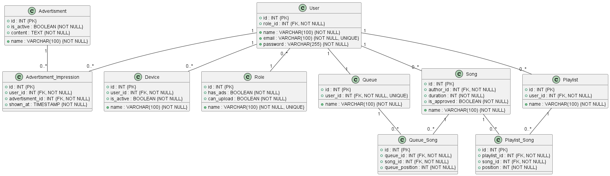

# PostgreSQL Music Streaming Service

A PostgreSQL database project modeling the core data and processes of a music streaming platform.

The system covers users and roles, registered devices, advertisements, songs, playback queues, playlists, reproducible seed-data generation, transactional queue management, song-popularity analytics, artist rankings, custom views, indexes, and query-performance analysis.

> [!IMPORTANT]
> This repository contains a **team project** jointly created by **Dominik Jurkas** and **Filip Hromada**. Dominik Jurkas is not the sole author.

## Features

- Four user roles:
  - `USER`
  - `PREMIUM_USER`
  - `ARTIST`
  - `ADMIN`
- Role-based advertisement and upload permissions
- Multiple devices per user
- Songs uploaded by artists and approved by administrators
- One playback queue per user
- Multiple playlists per user
- Ordered queue and playlist contents
- Duplicate-song prevention
- Advertisement-impression tracking
- PostgreSQL `CHECK`, `UNIQUE`, `FOREIGN KEY`, and `DEFAULT` constraints
- Reproducible synthetic dataset containing more than 54,000 records
- Three reusable SQL views
- Three custom indexes beyond automatically created PK and UNIQUE indexes
- Queue insertion, reordering, and deletion workflows
- Song and artist popularity rankings using window functions
- One-hit-wonder analysis
- `EXPLAIN ANALYZE` performance comparison

## Repository structure

```text
.
├── schema.sql
├── seed.sql
├── generate_seed.py
├── queries.sql
├── diagram.png
├── report.pdf
└── README.md
```

| File | Description |
| --- | --- |
| `schema.sql` | Creates the complete PostgreSQL schema and integrity constraints |
| `seed.sql` | Pre-generated deterministic demonstration dataset |
| `generate_seed.py` | Python generator used to recreate `seed.sql` |
| `queries.sql` | Views, indexes, queue-management process, analytical queries, and performance experiments |
| `diagram.png` | Physical database diagram |
| `report.pdf` | Full Slovak-language project documentation |
| `README.md` | Repository documentation |

## Database model



The schema contains ten tables.

| Table | Purpose |
| --- | --- |
| `Role` | Defines user types and their advertisement/upload permissions |
| `"User"` | Stores all platform users and their assigned roles |
| `Device` | Stores devices registered to individual users |
| `Advertisment` | Stores advertisements available in the system |
| `Advertisment_Impression` | Records when a specific advertisement is shown to a user |
| `Song` | Stores songs, authors, duration, and approval state |
| `Queue` | Stores one playback queue for each user |
| `Queue_Song` | Connects songs to queues and stores their order |
| `Playlist` | Stores user-owned playlists |
| `Playlist_Song` | Connects songs to playlists and stores their order |

The table name `"User"` is quoted because `USER` is a reserved PostgreSQL keyword.

The original schema uses the identifier `Advertisment` rather than `Advertisement`; the repository preserves that naming for consistency with the submitted project.

## Main relationships

```text
Role 1 ─── N User
User 1 ─── N Device
User 1 ─── N Song
User 1 ─── 1 Queue
User 1 ─── N Playlist

Queue N ─── M Song       through Queue_Song
Playlist N ─── M Song    through Playlist_Song

User 1 ─── N Advertisment_Impression
Advertisment 1 ─── N Advertisment_Impression
```

## Integrity constraints

The schema moves important business rules into the database instead of relying only on application logic.

### User and role constraints

- Role names must be unique and non-empty.
- User emails must be unique.
- Emails are checked using a PostgreSQL regular expression.
- User names must not be empty.
- Stored password values must contain at least eight characters.
- A role referenced by a user cannot be deleted.

### Song constraints

- Song names must not be empty.
- Song duration must be between 1 and 7,200 seconds.
- New songs default to `is_approved = FALSE`.
- A song author cannot be deleted while their songs still exist.

### Queue and playlist constraints

- Every user can have only one queue.
- Playlist names must be unique within one user's account.
- A song can occur only once in a given queue or playlist.
- Two songs cannot share the same position in the same queue or playlist.
- Queue and playlist positions must be positive.

### Referential actions

The project uses explicit `ON DELETE` and `ON UPDATE` strategies.

- `Role → User`: `ON DELETE RESTRICT`
- `User → Song`: `ON DELETE RESTRICT`
- Dependent devices, queues, playlists, impressions, and association records: `ON DELETE CASCADE`
- Foreign-key updates: `ON UPDATE CASCADE`

## Seed data

The included `seed.sql` file contains **54,076 records**.

| Table | Records |
| --- | ---: |
| `Role` | 4 |
| `"User"` | 2,000 |
| `Device` | 3,276 |
| `Advertisment` | 50 |
| `Advertisment_Impression` | 8,000 |
| `Song` | 3,000 |
| `Queue` | 2,000 |
| `Queue_Song` | 9,215 |
| `Playlist` | 2,616 |
| `Playlist_Song` | 23,915 |
| **Total** | **54,076** |

### Data distribution

The generator uses weighted, non-uniform distributions to better approximate a real streaming service.

User-role distribution:

| Role | Approximate count |
| --- | ---: |
| `USER` | 1,595 |
| `PREMIUM_USER` | 250 |
| `ARTIST` | 150 |
| `ADMIN` | 5 |

Additional characteristics include:

- approximately 85% approved songs,
- power-law distribution of songs per artist,
- many passive users without playlists,
- a small number of playlist curators with many playlists,
- empty queues for some users and large queues for power users,
- advertisement impressions concentrated among heavy users.

### Reproducibility

`generate_seed.py` uses:

```python
random.seed(42)
Faker.seed(42)
```

The output is therefore deterministic when generated with the same environment.

The generator also:

- truncates all tables before insertion,
- inserts records in batches,
- assigns explicit IDs,
- resets PostgreSQL sequences with `setval`,
- generates only approved songs inside queues and playlists,
- assigns song authors only from users with the `ARTIST` role,
- generates advertisement impressions only for roles that display advertisements.

## SQL views

`queries.sql` defines three views.

### `v_user_queue`

Combines:

- queue ownership,
- queue positions,
- song details,
- artist names.

Example:

```sql
SELECT *
FROM v_user_queue
WHERE user_id = 4
ORDER BY queue_position;
```

### `v_song_popularity`

Calculates song popularity as the number of playlists containing each song.

Songs that do not occur in any playlist are still included with a popularity count of zero.

Example:

```sql
SELECT *
FROM v_song_popularity
ORDER BY playlist_count DESC
LIMIT 20;
```

### `v_artist_stats`

Aggregates statistics for each artist:

- number of approved songs,
- total playlist appearances,
- average song popularity,
- popularity of the artist's most successful song.

Example:

```sql
SELECT *
FROM v_artist_stats
ORDER BY avg_popularity DESC;
```

## Custom indexes

PostgreSQL automatically creates indexes for primary keys and unique constraints. The project adds three additional indexes.

### `idx_playlist_song_song_id`

```sql
CREATE INDEX idx_playlist_song_song_id
ON Playlist_Song (song_id);
```

Supports popularity calculations that join `Playlist_Song` by `song_id`.

The existing unique index on `(playlist_id, song_id)` cannot efficiently support lookups using only `song_id`, because `song_id` is not its leading column.

### `idx_song_author_approved`

```sql
CREATE INDEX idx_song_author_approved
ON Song (author_id)
WHERE is_approved = TRUE;
```

A partial index supporting queries that analyze approved songs grouped by artist.

### `idx_user_role_id`

```sql
CREATE INDEX idx_user_role_id
ON "User" (role_id);
```

Supports filtering users by role, especially when selecting artists.

## Process 1: Queue management

The first process implements three queue operations:

1. adding an approved song to the end of a user's queue,
2. moving a song to a different queue position,
3. removing a song and closing the resulting position gap.

### Add a song

The insertion query verifies that:

- the queue belongs to the selected user,
- the song exists,
- the song is approved,
- the song is not already present in the queue.

The new position is calculated as:

```text
MAX(queue_position) + 1
```

### Reorder a song

Because queue positions are protected by a unique constraint, directly shifting multiple rows can create temporary collisions.

The project therefore uses a four-step algorithm:

1. move the selected song to temporary position `999999`,
2. move affected songs into a temporary range above `1000000`,
3. return them to their shifted final positions,
4. move the selected song to its requested position.

This preserves uniqueness during every intermediate update.

### Remove a song

Removal uses two steps:

1. delete the selected row,
2. decrement all later positions to keep the queue continuous.

> [!NOTE]
> The queue demonstration in `queries.sql` operates on `user_id = 4` and changes the seeded data. Re-run `seed.sql` to restore the original state.

## Process 2: Popularity analytics

The second process provides three analytical outputs.

### Top 20 songs

Song popularity is defined as the number of playlists containing the song.

The ranking uses:

```sql
DENSE_RANK() OVER (ORDER BY playlist_count DESC)
```

Songs with equal popularity therefore receive the same rank.

### Artist ranking

Artists are ranked by:

- average popularity of approved songs,
- total playlist appearances.

Only artists with at least three approved songs are included to reduce statistical noise from artists with a single successful song.

### Top 10 one-hit wonders

The query identifies artists whose best-performing song is substantially more popular than their average song.

The analysis includes:

- top-song popularity,
- average popularity,
- absolute difference,
- percentage dominance of the top song.

## Requirements

- PostgreSQL 14 or newer
- `psql`, pgAdmin, DBeaver, DataGrip, or another PostgreSQL client
- Python 3.9 or newer to regenerate seed data
- Optional Python package: `Faker`

Install Faker with:

```bash
python -m pip install Faker
```

The generator contains fallback name generators and can run without Faker, but Faker produces more realistic data.

## Database setup

Create a new PostgreSQL database:

```bash
createdb music_streaming
```

Create the schema:

```bash
psql -d music_streaming -f schema.sql
```

Load the included dataset:

```bash
psql -d music_streaming -f seed.sql
```

### Execute the project queries

```bash
psql -d music_streaming -f queries.sql
```

> [!WARNING]
> `queries.sql` is not only a read-only analytics script. It also:
>
> - adds a song to the queue of user `4`,
> - changes queue positions,
> - removes a queue entry,
> - drops and recreates an index during the `EXPLAIN ANALYZE` comparison.
>
> Run it on the seeded demonstration database or execute its sections individually.

To restore the original data:

```bash
psql -d music_streaming -f seed.sql
```

## Regenerating the dataset

Create and activate a virtual environment:

```bash
python -m venv .venv
```

Windows:

```powershell
.venv\Scripts\activate
```

Linux or macOS:

```bash
source .venv/bin/activate
```

Install Faker:

```bash
python -m pip install Faker
```

Generate a new `seed.sql` file:

```bash
python generate_seed.py
```

Load it into PostgreSQL:

```bash
psql -d music_streaming -f seed.sql
```

## Performance analysis

The project includes an `EXPLAIN (ANALYZE, BUFFERS)` comparison for the song-popularity query before and after creating `idx_playlist_song_song_id`.

The report documents a clear execution-time reduction in the tested environment. Exact plans and timings depend on:

- PostgreSQL version,
- available memory,
- cached pages,
- statistics,
- operating system,
- repeated execution.

Window functions such as `DENSE_RANK` still require sorting. For substantially larger datasets, possible optimizations include:

- materialized views,
- pre-aggregated popularity tables,
- scheduled ranking refreshes,
- incremental aggregation.

## Example queries

### Show the contents of a user's queue

```sql
SELECT
    queue_position,
    song_name,
    author_name,
    duration
FROM v_user_queue
WHERE user_id = 4
ORDER BY queue_position;
```

### Show the most popular songs

```sql
SELECT
    song_name,
    playlist_count
FROM v_song_popularity
WHERE is_approved = TRUE
ORDER BY playlist_count DESC
LIMIT 20;
```

### Show the most consistently popular artists

```sql
SELECT
    artist_name,
    total_songs,
    total_appearances,
    avg_popularity
FROM v_artist_stats
WHERE total_songs >= 3
ORDER BY avg_popularity DESC
LIMIT 20;
```

## Known limitations

- The repository contains only the database layer, not a web, desktop, or mobile application.
- Password values are synthetic hash-like strings; no authentication system is implemented.
- The rule that only artists can upload songs is maintained by seed generation and application/process logic, not by a trigger.
- The rule that only approved songs can enter queues and playlists is not enforced by a foreign-key or check constraint.
- Advertisement eligibility is handled by generation or application logic rather than a database trigger.
- `queries.sql` combines schema objects, demonstrations, mutations, analytics, and performance experiments in one file.
- Queue reordering uses large temporary numeric offsets and should be wrapped in a transaction in a production implementation.
- Concurrent queue edits are not explicitly protected with row locks.
- Popularity is based on playlist membership, not actual playback history.
- The schema uses `SERIAL`; modern PostgreSQL projects may prefer identity columns.
- The identifier `Advertisment` contains a spelling error preserved from the original schema.
- No automated database-test framework or CI pipeline is included.

## Possible improvements

- Split `queries.sql` into separate files for views, indexes, queue operations, analytics, and benchmarks.
- Implement queue operations as transactional PL/pgSQL functions.
- Use deferred constraints or a dedicated ordering strategy for queue reordering.
- Add concurrency control with row-level locking.
- Replace `SERIAL` with `GENERATED ... AS IDENTITY`.
- Introduce play-history and listening-session tables.
- Track likes, follows, albums, genres, subscriptions, and payments.
- Add database roles and permissions.
- Add migrations with Flyway or Liquibase.
- Add repeatable pgTAP tests.
- Add Docker Compose for PostgreSQL.
- Hash and verify real passwords in an application layer.
- Add materialized popularity views for larger datasets.

## Documentation

Detailed Slovak-language documentation is available in:

[`report.pdf`](report.pdf)

It covers:

- changes from the initial conceptual design,
- physical-model implementation,
- integrity constraints,
- seed-data generation,
- queue management,
- popularity analytics,
- indexes,
- `EXPLAIN ANALYZE`,
- implementation reflection.

## Team

This project was jointly created by:

- **Dominik Jurkas**
- **Filip Hromada**

Faculty of Informatics and Information Technologies  
Slovak University of Technology in Bratislava
